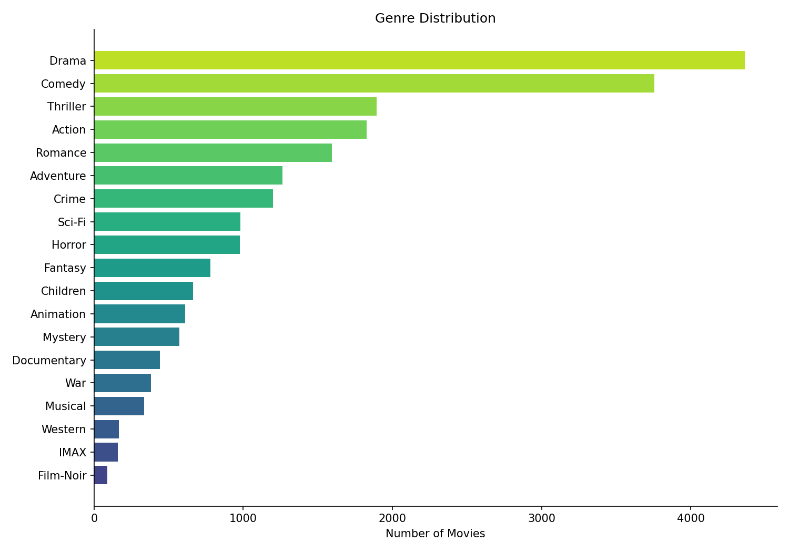
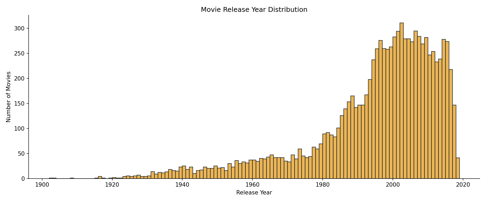

<div align="center">

# `CINEMATCH`

**Hybrid movie recommendation system using collaborative SVD and content TF-IDF**


*Search for a film. Explore curated recommendations.*

[](https://movie-recommendation-system-7tww.onrender.com/)

</div>

---

## 🔍 About

> [!IMPORTANT]
> **Model Training Notebook**: The full pipeline - data loading, cleaning, genre/tag preprocessing, SVD and TF-IDF training, and evaluation - is available in [`notebook/train_model.ipynb`](notebook/train_model.ipynb).

This is a movie recommendation system that suggests relevant films based on user ratings and content metadata. It uses a MovieLens dataset containing 9,742 movies, 100,836 ratings, and 3,683 tags.

The system uses a hybrid recommendation model. If a queried movie has 20 or more user ratings, it uses a collaborative filtering engine powered by TruncatedSVD (50 components) trained on user-mean-centered ratings. If the movie has fewer than 20 ratings, it falls back to a content-based recommendation engine powered by a TF-IDF vectorizer and on-demand cosine similarity computed over movie genres and user-contributed tags.

The user interface uses a segmented tab navigation centered at the top, allowing the user to toggle between `01 / FIND FILM` and `02 / SUGGESTIONS`. When a film is searched and selected, the dashboard displays its metadata (genres, year, and direct IMDb link) and fetches suggestions. Rather than automatically redirecting the user, the suggestions tab enables in place, letting the user switch views manually once they are ready. The UI features a high-contrast editorial look with a warm ivory paper background (`#fcfbf9`), deep ink text (`#1a1917`), and rust-red accents (`#d93829`).

> [!NOTE]
> The collaborative filtering engine achieves a **0.9320 Test RMSE** (Root Mean Squared Error) and a **0.7188 Test MAE** (Mean Absolute Error) on a random 80/20 train-test split of the ratings dataset.

---

## ✨ Features

### Core Recommendation Engine

- **Hybrid Switching Logic** - Automatically routes requests through collaborative filtering for highly-rated films and falls back to content-based TF-IDF logic for less popular or niche films.

- **Sparse User-Item Matrix** - Uses SciPy's sparse matrices (`csr_matrix`) to scale user rating profiles efficiently during collaborative training.

- **IMDb Mapping Integration** - Enriches recommendations by mapping MovieLens IDs to IMDb IDs via `links.csv`, enabling direct links to IMDb film pages.

- **On-Demand Content Similarity** - Calculates cosine similarity matrices on the fly, avoiding massive precomputed tables in memory and keeping the server footprint extremely small.

> [!TIP]
> The threshold for collaborative recommendations is set to 20 ratings. Out of 9,742 movies in the catalog, 1,297 meet this requirement and use collaborative SVD signals. Niche titles fall back to text-similarity matching.

### UI and Experience

- **Two-Page Layout** - Tabbed architecture separates search interactions from recommendation tables. Segmented buttons toggle smoothly without full-page reloads.

- **Manual Toggle Control** - Selecting a movie updates search-page details and pre-fetches recommendations, but leaves the user in control of when to switch tabs.

- **Warm Paper Theme** - Clean layout inspired by editorial catalogs. Features serif titles (DM Serif Display) paired with monospaced metadata columns (Space Mono).

- **Catalog Highlights Panel** - Displays metadata context (date span, ratings count, and core genres) directly on the landing page to fill empty workspace and guide the user.

- **Responsive Design** - Cards stack cleanly and search containers expand to fit mobile viewports automatically.

### Backend and API

- **Singleton Model Loader** - Deserializes the vectorizers, SVD matrices, lookup dictionaries, and similarity indexes once at application startup.

- **Pydantic Validation** - Validates inputs and structures outputs for all search, health, and recommendation endpoints.

- **FastAPI Documentation** - Serves interactive OpenAPI documentation at `/docs` out of the box.

---

## 🛠️ Built With

| Technology | Role in this project |
|---|---|
|  | Core runtime for data cleaning, model training, and API server execution |
|  | TF-IDF Vectorizer for metadata analysis and TruncatedSVD for collaborative filtering |
|  | Web API routes and request/response validation |
|  | ASGI web server running the FastAPI application |
|  | Parses, merges, and prepares MovieLens datasets (`movies`, `ratings`, `tags`, `links`) |
|  | Document structure and accessibility mappings |
|  | Brutalist styling using CSS custom properties |
|  | Tab control, search autocomplete, and asynchronous API integration |

---

## 📊 Model Evaluation

These plots are generated during training and saved to `model/plots/`.

<div align="center">

### Genre Distribution


*The count of movies across the top genres in the MovieLens catalog.*

<br/>

### Movie Release Year Distribution


*A histogram detailing the distribution of movies by release year, spanning from 1874 to 2018.*

</div>

---

## ⚙️ Technical Details

### Project Structure

```
Movie Recommendation System/
├── app/
│   ├── __init__.py             # App initialization
│   ├── main.py                 # FastAPI endpoints and middleware
│   ├── model_loader.py         # Singleton model manager and similarity handlers
│   └── schema.py               # Pydantic request/response structures
├── data/
│   ├── movies.csv              # Movie catalog details (9,742 rows)
│   ├── ratings.csv             # User ratings (100,836 rows)
│   ├── tags.csv                # User tags (3,683 rows)
│   └── links.csv               # IMDb link mapping
├── model/
│   ├── collab_model.pkl        # Serialized SVD components and maps
│   ├── tfidf_vectorizer.pkl    # Serialized TF-IDF vectorizer
│   ├── movie_feature_vectors.pkl # Pre-computed movie TF-IDF sparse matrices
│   ├── movie_lookup.pkl        # Movie metadata quick-access map
│   ├── id_to_idx.pkl           # ID index conversion helpers
│   ├── metrics.pkl             # Evaluated RMSE and MAE scores
│   └── plots/
│       ├── genre_distribution.png
│       └── year_distribution.png
├── frontend/
│   ├── index.html              # Search and recommendations markup
│   ├── style.css               # Warm Paper theme styling rules
│   └── script.js               # Tab views, query logic, and display rendering
├── notebook/
│   └── train_model.ipynb       # Full training, evaluation, and plot generation notebook
├── requirements.txt            # Python dependencies
├── .gitignore                  # Git ignore rules
└── README.md
```

### Model Details

| | |
|---|---|
| **Dataset** | MovieLens ml-latest-small (100k ratings, 9.7k movies) |
| **Features** | Movie genres, Aggregated user tags, User ratings |
| **Collaborative Algorithm** | TruncatedSVD (50 components) |
| **Content-Based Algorithm** | TF-IDF Vectorizer (max 5,000 features, 1-2 ngrams) + Cosine Similarity |
| **Switching Threshold** | 20 ratings (collab if >= 20, content fallback if < 20) |
| **Test Evaluation (SVD)** | RMSE: **0.9320** \| MAE: **0.7188** |

### API Reference

Interactive OpenAPI documentation is available at `/docs` when running the server.

**`GET /health`**

Response:
```json
{
  "status": "healthy",
  "catalog_size": 9742
}
```

**`GET /search`**

Parameters:
- `query` (string, required): Partial movie title.
- `limit` (integer, optional, default: 10): Max results.

Response:
```json
{
  "query": "Toy Story",
  "count": 3,
  "results": [
    {
      "movie_id": 1,
      "title": "Toy Story (1995)",
      "genres": "Adventure|Animation|Children|Comedy|Fantasy",
      "year": 1995,
      "imdb_id": "tt0114709"
    }
  ]
}
```

**`GET /recommend/{movie_id}`**

Parameters:
- `movie_id` (integer, required): MovieLens movie ID.
- `n` (integer, optional, default: 10): Number of recommendations (1-30).

Response:
```json
{
  "source_movie": {
    "movie_id": 1,
    "title": "Toy Story (1995)",
    "genres": "Adventure|Animation|Children|Comedy|Fantasy",
    "year": 1995,
    "imdb_id": "tt0114709"
  },
  "recommendations": [
    {
      "movie_id": 3114,
      "title": "Toy Story 2 (1999)",
      "genres": "Adventure|Animation|Children|Comedy|Fantasy",
      "year": 1999,
      "imdb_id": "tt0120363",
      "similarity_score": 0.8122,
      "method": "collaborative"
    }
  ],
  "method": "collaborative"
}
```

### 💻 Local Setup

```bash
# 1. Clone the repository
git clone https://github.com/yash5123/Movie-Recommendation-System.git
cd "Movie-Recommendation-System"

# 2. Install dependencies
pip install -r requirements.txt

# 3. (Optional) Run the training notebook
# jupyter notebook notebook/train_model.ipynb

# 4. Run the FastAPI development server
uvicorn app.main:app --host 127.0.0.1 --port 8000
```

Once running, navigate to `http://127.0.0.1:8000` to access the search catalog.

### 🚀 Deployment

FastAPI serves both the API endpoints and the static catalog files from one process.

| Setting | Value |
|---|---|
| **Build Command** | `pip install -r requirements.txt` |
| **Start Command** | `uvicorn app.main:app --host 0.0.0.0 --port $PORT` |
| **Runtime** | Python 3.11+ |

---

<div align="center">

### Made by Yash

[](https://github.com/yash5123)

</div>
